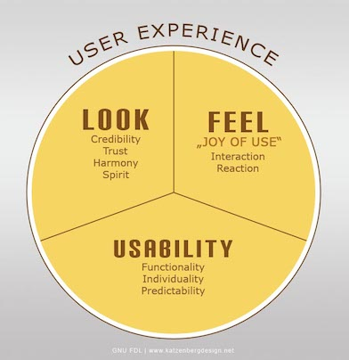

<h3> The beginning </h3>

Growing up, I never pictured myself studying within computer science or technology. I loved theater, sports, and most of all: people. So I thought, I´m going to work with people and not computers. But at some point I realised that those two things had more to do with each other than i thought. 

For my studies I had considered law, psychology or economics. Mainly because my goal was to work with helping people, and at that point I didn’t believe computer science had anything to do with that. As my big sister is a computer engineer she introduced me to User Experience Design, and convinced me that it was worth a shot. I don’t know if it was my 3 months trip to Asia that confused me and made me trust her, or if my sister just is a really good seller.

<h3>My path</h3>
After my first week at University I knew I had made the right choice, because User Experience Design was ALL about helping people. I started growing interest for both programming, user experiences, testing, design, and everything related to it. I really enjoyed the web development classes, because it enabled me to create visual prototypes and products in a short amount of time. Our teachers goal is that we´re becoming the people that both masters designing and a decent level of programming. We’re becoming what they call “the glue in a development team”. 

In addition to developing new ideas, we have also learned how to produce solutions designed for great user experiences. With today's diversity of technological services, is it not longer enough to just get a great idea developed,  it has to be appealing to the users. And that's what my major is all about. 

<h3>Hello future</h3>

For the future am I really interested in acquiring both programming and design skills related to app development. In today's society, smartphones are very widespread, constituting a large market for applications. Personally, not a day goes by without annoying me about the interface of several of my apps. I know I’m not alone, and I want to rescue the world from terrible user interfaces, one app at the time. 
