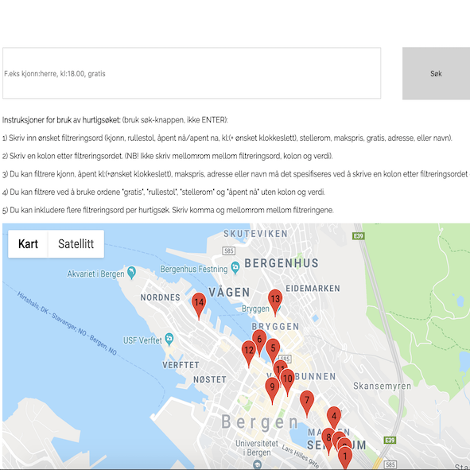

"Livet i vest" is a responsive web page made in one of the classes I took at the University of Bergen, spring 2018. The task was to use two optional public datasets, and the Google Maps API, to produce a web page which included a quick- and advanced search. My group made a site that showed all public toilets, clubs and also upcoming events in two different cities of Norway. The site allowed the user to navigate between the different function through a hamburger menu. We offered a quick- and an advanced search function on the toilet page, allowing the user to customize the map with toilets fitted for their use. For example, if the user only wanted free toilets, then a search could help him/her to only display toilets without a fee.

To do this we used the coding languages HTML, CSS and JavaScript. We used a XMLHttp Request to access public datasets in JSON-format, and parsed it to collect the information we needed to run a search. It was possible to sort toilets based on their attributes like fee or sex, after parsing the file from JSON and back to JavaScript. I add a bit of source code at the end of this paragraph. The project was successful and we managed to deliver a perfectly working site on time. 

```js
//A function that gets the data from a public dataset
function hentData(url) {
    return new Promise(function(resolve, reject) {
        let xhr = new XMLHttpRequest();
        xhr.open("GET", url);
        xhr.onreadystatechange = function() {
            if (xhr.readyState === 4) {
                if (xhr.status === 200) {
                    resolve(samling = JSON.parse(xhr.responseText).entries);
                } else {
                    reject(xhr.statusText);
                }
            };
        }
        xhr.send();
    });
}
```
