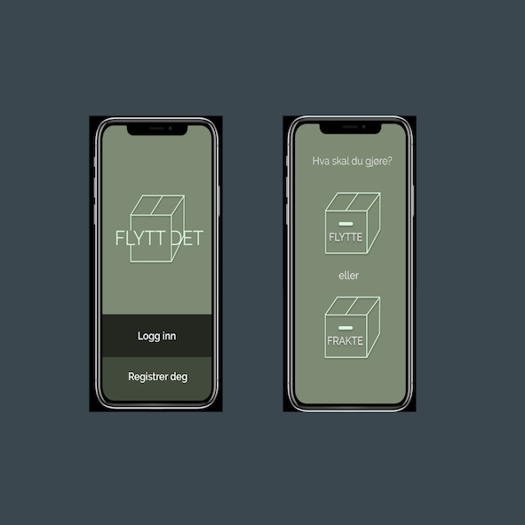

  
  

In March 2019 the company NCE media hosted a hackathon at Media City Bergen, Norway. The goal was to: "Make a product or service for the future of sustainable mobility". We were given 19 hours to solve the problem, come up with a solution and make a presentation selling our product to a panel of judges. The judges came from different companies like NCE media, Sparebanken Vest(bank), IBM and Bergen Kommune. They considered the result based on the idea, feasibility, originality and its potential of contributing to a more sustainable future. The event was open for everyone, and didn’t regard any technical skills, but it was considered a bonus for solving the problem.

My team consisted of three fellow students, where were girls and all have their major in UX design. Due to the minimal time limit we had to think fast, and brainstorm effectively. To accomplish that, we used tools from google venture design sprint, which helped us agree on one goal and one concept.

We wanted to minimize the CO2 emissions for environmental reasons, by reducing the number of cars on the road. Students move every semester, without any good eco-friendly solutions for transporting their moving loads. We solved this with an application made for students, to get in touch with people going the same destination. The application reduces the number of cars on the road, by giving the users an opportunity to place their stuff with someone that’s already driving to the same destination. In addition, we’ll avoid driving back and forth, as if the parents have to drive the students. We made a high-fidelity prototype in figma, which shows the interface we presented at the hackathon. 

